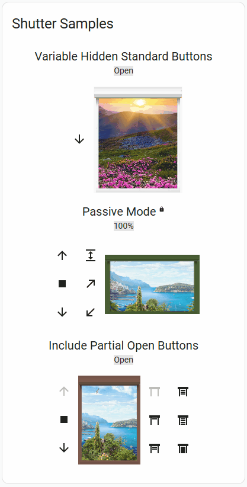
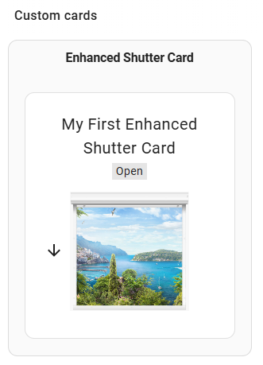

# Easy Cover Styler Card

[](https://github.com/hacs/integration)

A flexible Home Assistant Dashboard card for **shutters, blinds, awnings, curtains, shades, windows and doors** — with a graphical, animated cover that opens/closes/tilts, a full visual editor, area/label auto-generation, and extensive layout and styling options.



## Installation

**HACS (recommended):**

[](https://my.home-assistant.io/redirect/hacs_repository/?owner=Ltek&repository=easy-cover-styler-card&category=dashboard)

...or in HACS search for `Easy Cover Styler Card`. The resources are configured automatically.

If the button doesn't work, add this repository as a [Custom Repository](https://www.hacs.xyz/docs/faq/custom_repositories/): URL `https://github.com/Ltek/easy-cover-styler-card`, type `Dashboard`.

Once installed, find it in the card picker (**+ Add card → By Card**) when building a Dashboard:



> **Upgrading from Flex Cover Card or Enhanced Shutter Card?** Existing cards using `type: custom:flex-cover-card` or `type: custom:enhanced-shutter-card` keep working via built-in aliases; the canonical type is now `custom:easy-cover-styler-card`. Re-saving a card in the visual editor rewrites it to the new type automatically.

---
## Features

**Cover control**
- Open / close / stop and set-position via **buttons** and/or a **slider**.
- **Partial-close** button to jump to a preset % in one tap.
- **Tilt** support (buttons, slider and 3D slat visualization) — shown only when the cover reports tilt.
- **Passive mode** — interface works but sends no commands (a lock icon marks the cover).
- Reads the cover's `supported_features`, so only the controls the device actually supports are shown.

**Cover types & imagery**
- Built-in **presets**: `roller-shutter`, `curtain`, `awning`, `shade`, `blind`, `window`, `balcony-door-left`, `balcony-door-right`, `compact`.
- Animated graphical cover built from four image slots — **window frame**, **background view**, **shutter slat** and **bottom bar** — each accepting an image filename **or** a CSS color.
- **Closing direction** down / left / right.
- Bundled image library (grey/brown/green windows, curtain, awning, blind, city & outdoor views, window frames, balcony doors); the editor's image fields **autocomplete** from it. Use your own images via `image_map` or a full path.
- Adjustable size per cover (`base_width_px`/`base_height_px`, resize %, top/bottom offsets); scale texts/buttons/icons **off / auto / custom factor**.

**Auto-generation (no manual entity list)**
- Build the card from Home Assistant **Areas** or **Labels**, filtered by device-class (`auto_filter`).
- Custom area/label display names; **strip the room name** from labels; **name cleaner** (remove words, title-case).

**Per-area & per-entity presets**
- Assign a cover-type preset (with its images/behavior) to a **whole area** (`area_presets`) or to **specific covers** (`entity_presets`). A per-entity preset wins over a per-area one.

**Layout**
- Vertical or horizontal **stack**, or the **area-selector layout** (area buttons + a full-area **All** control + collapsible covers).
- **All** aggregate fans open/close/stop/set-position to every cover in the area/label and shows their average position.
- **Group control panel** (name / hide / sticky); inline-with-covers or beside-the-menu placement.
- Covers-per-row grid, wrap or independent scroll; **reorder the elements** inside each cover.
- Button position left/right/top/bottom/auto; button padding, group spacing, and controls↔image / header↔image gaps.

**Header & status**
- Name and position text with **size / weight / color** (four-mode color control), top/bottom placement, same-line option, alignment, order and spacing.
- **Battery** and **signal** icons — auto-discovered, off, or a custom `sensor.*`; independent placement (row + alignment) and show/hide.
- Position readout as plain text or a highlight box; `always_percentage`; invert percentage / open-close at **UI** or **device** level; tilt angle min/max.

**Buttons & styling**
- Hide individual buttons per cover **state**; disable end buttons; position-preset buttons as **icons or % values** (with custom percentages).
- Four-mode **color styling** for control icons and % buttons; **custom mdi** icon overrides; % buttons can use the shared **Button Styles Library**.
- **Dividers** between covers (line/gradient/label/icon); area buttons via the shared **Button Styles Library**.

**Editor & output**
- Full **visual editor** (schema-driven) matching the shared card design language, with grouped panels, four-mode color controls and a read-only **YAML preview**. Output is byte-stable (only non-default settings are written).
- Works **fully offline** (bundled Lit).

## Images & backgrounds

Each cover is drawn from up to four slots — **window frame**, **background view**, **shutter slat** and **bottom bar** — chosen from labelled dropdowns in the visual editor (**Cover Images** panel). Bundled artwork includes roller-shutter sets (grey / brown / green), curtain, awning, Venetian blind, a semi-transparent shade tint, fine and dense window-screen mesh, window frames, outdoor views and balcony doors. Any slot also accepts a **CSS colour** instead of an image, and you can point to your own files via the **Images base path** (or a full `/local/...` path).

Easy Cover Styler Card is a modernized fork of [Deejayfool's hass-shutter-card](https://github.com/deejayfool/hass-shutter-card), with additional window/door/view artwork from [pic-shutter-card](https://github.com/samoswall/pic-shutter-card) (see [Image credits](#image-credits)).

## Configuration

The easiest way to configure the card is the **visual editor**: open the card's **⋮ → Edit** and every option — layout, images, header & status, buttons, colours, dividers, scaling, and per-area / per-entity presets — is available as a labelled control, with a live YAML preview.

The sections below cover the options most useful to know about (auto-generation and presets); everything else is discoverable in the editor.

### Auto-generate & Layout

Instead of listing every cover under `entities:`, you can let the card discover covers by **Home Assistant Area** or by **Label**, and pick an optional **area-selector layout**. `entities:`, `areas:` and `labels:` are all optional individually, but you must supply at least one of them.

|      Name      |       Type        | Required |  Default   | Global | Local | Description                                                                                                                                                                          |
| -------------- | ----------------- | -------- | ---------- | ------ | ----- | ---------------------------------------------------------------------------------------------------------------------------------------------------------------------------------- |
| areas          | string list       | No       | -          | Yes    | No    | Auto-generate covers from these Areas. Each entry is an area name or `area_id`. A cover matches when its own area, or its device's area, is one of these.                            |
| labels         | string list       | No       | -          | Yes    | No    | Auto-generate covers from these Labels. Each entry is a label name or `label_id`. (Use either `areas:` or `labels:`, not both — `areas:` wins if both are set.)                     |
| auto_filter    | object            | No       | see remark | Yes    | No    | `{ device_class: [...], exclude: [...] }`. `device_class` (allowlist) limits which cover device-classes are included; `exclude` (default `[garage, gate, door]`) drops those classes. |
| area_names     | object            | No       | -          | Yes    | No    | Map of `area_id`/name → custom display name shown on the area button.                                                                                                               |
| label_names    | object            | No       | -          | Yes    | No    | Map of `label_id`/name → custom display name shown on the label button.                                                                                                            |
| layout         | string            | No       | `stack`    | Yes    | No    | `stack` = the classic vertical/horizontal stack. `areas` = the area-selector layout: a column of area/label buttons + a full-area **All** control on the top row, and that area's individual covers on the row below. |
| all_label      | string            | No       | `All`      | Yes    | No    | Name shown on the per-area/label aggregate control. That control fans **open / close / stop / set-position** out to every cover in the selected area/label, and shows their average position. |
| area_presets   | object            | No       | -          | Yes    | No    | Map of `area_id`/name → an override object (e.g. `{ shutter_preset: window-shutter }`, or any image/style keys) applied to every auto-collected cover in that area. |
| entity_presets | object            | No       | -          | Yes    | No    | Map of `entity_id` → an override object applied to that specific cover. **Wins over `area_presets`** and the cover-type preset, but is still overridden by an inline `entities:` entry. |

_Remark: when neither `device_class` allowlist is given, every `cover.*` entity in the area/label is included except the classes in `exclude`._

_Precedence (low → high): card defaults → card-level YAML → `shutter_preset` (cover-type) → `area_presets` → `entity_presets` → inline `entities:` config._

### Presets (cover types)

A preset is a starting look/behaviour; any image slot you set (globally, or per-area/entity) overrides it:

- **roller-shutter** — classic grey roller shutter (default)
- **curtain** — fabric curtain, closes sideways
- **awning** — awning fabric, inverted open/close
- **shade** — semi-transparent dark tint
- **screen** — semi-transparent window/insect mesh (a denser variant is also bundled)
- **blind** — Venetian blind slats
- **window-shutter** — roller shutter over a window frame with an outdoor view
- **balcony-door-left / balcony-door-right** — roller shutter over a balcony door
- **compact** — minimal layout (open/close slider instead of the big window)

### Sample — auto-generate + area-selector layout

Discover covers per Area and show the area-selector layout (buttons on the left, a full-area **All** control beside them, the room's covers below):

```yaml
type: custom:easy-cover-styler-card
title: Shades by room
layout: areas
shutter_preset: blind
areas:
  - Kitchen
  - Living Room
  - Play Room
  - Master Bedroom
auto_filter:
  exclude:
    - garage
area_names:
  living_room: Lounge
```

Or discover by Label instead of Area (classic stacked layout):

```yaml
type: custom:easy-cover-styler-card
title: All blinds
labels:
  - blinds
```

### Sample — per-area & per-entity presets

Give every cover in an area a cover-type preset (with its images), and override one specific cover:

```yaml
type: custom:easy-cover-styler-card
title: Windows & doors
layout: areas
areas:
  - Living Room
  - Kitchen
area_presets:
  Living Room:
    shutter_preset: window-shutter      # all Living Room covers look like a window
  Kitchen:
    shutter_preset: balcony-door-left   # all Kitchen covers use the balcony door
entity_presets:
  cover.kitchen_patio:
    shutter_preset: balcony-door-right  # this one cover wins over the area preset
```

---

## Image credits

Some bundled cover images come from other open-source projects:

- Base roller-shutter imagery derives from **[hass-shutter-card](https://github.com/deejayfool/hass-shutter-card)** by deejayfool, licensed under **Apache-2.0**.
- The window frames, balcony-door, outside-view and curtain/blind images (bundled with the `psc-` filename prefix) come from **[pic-shutter-card](https://github.com/samoswall/pic-shutter-card)** by samoswall and are used **with the author's permission**.

See the [`NOTICE`](NOTICE) file for details.
