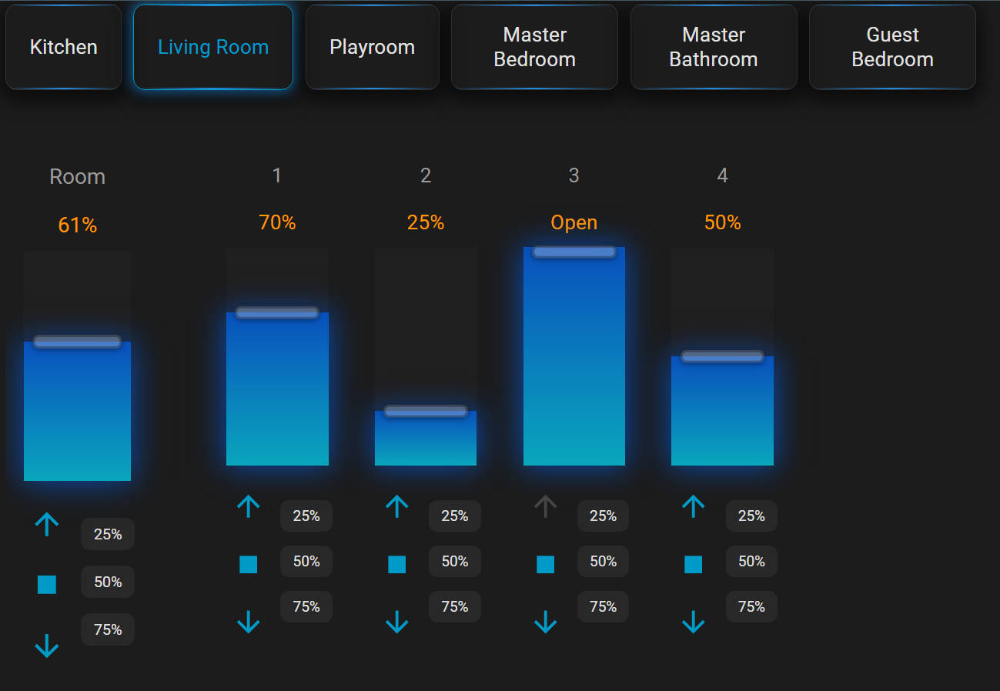
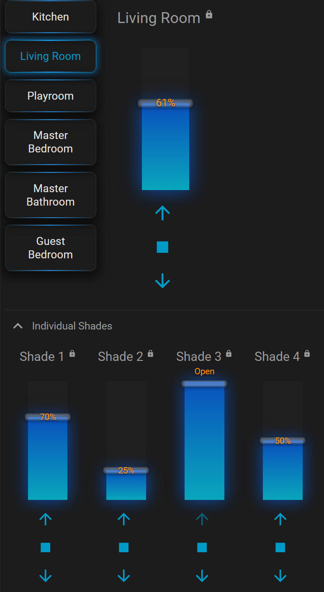
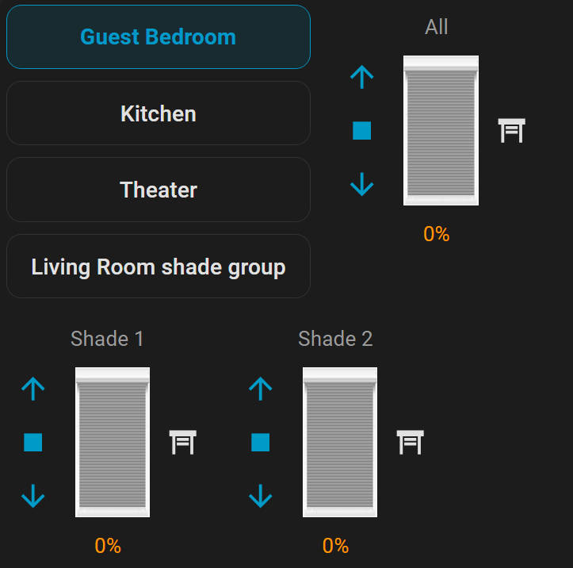
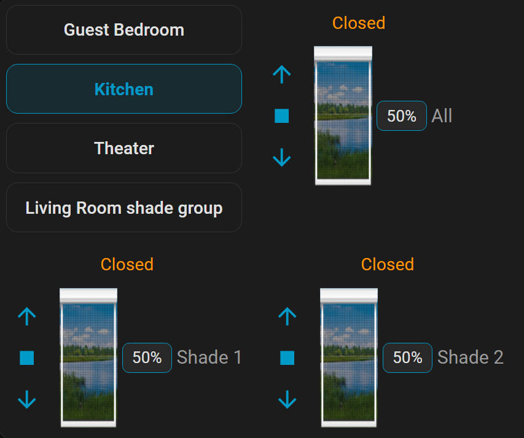
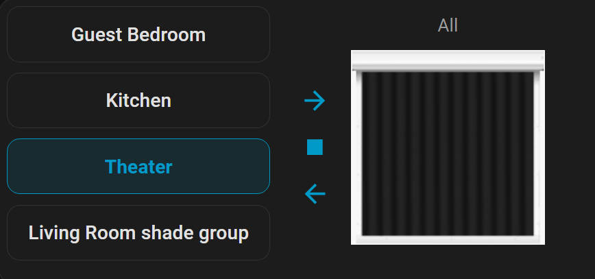
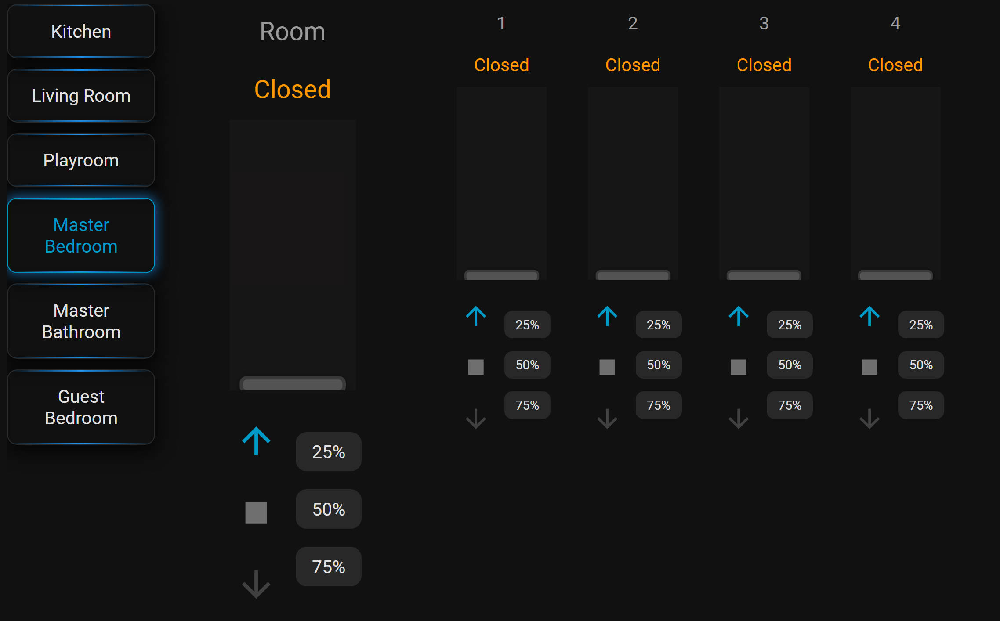

# Easy Cover Styler Card

A flexible Home Assistant Dashboard card for **shutters, blinds, awnings, curtains, shades, windows and doors** — with a graphical, animated cover that opens/closes/tilts, a full visual editor, area/label auto-generation, and extensive layout and styling options.

Current build: **v2026.10.01.191** · full history in [CHANGELOG.md](CHANGELOG.md)

## Installation

**HACS (recommended):**

[](https://my.home-assistant.io/redirect/hacs_repository/?owner=Ltek&repository=easy-cover-styler-card&category=dashboard)

The button opens HACS in your own Home Assistant with this repository pre-filled — add it, then click
**Download**. HACS registers the Dashboard resource for you.

This card is distributed as a **custom repository**, not through the HACS default store, so searching
HACS will not find it. If the button doesn't work, add it by hand:
HACS → **⋮ → Custom repositories** → URL `https://github.com/Ltek/easy-cover-styler-card`,
category **Dashboard**.

---
## Features

**Cover control**
- Open / close / stop and set-position via **buttons** and/or a **slider**.
- **Position Buttons** jump to a preset % in one tap (25 / 50 / 75 by default, or your own).
- **Tilt** support (buttons, slider and 3D slat visualization) — shown only when the cover reports tilt.
- **Passive mode** — interface works but sends no commands (a lock icon marks the cover).
- Reads the cover's `supported_features`, so only the controls the device actually supports are shown.

**Cover types & imagery**
- Four built-in **Cover Styles**: **Color Slider**, **Roller Shutter**, **Curtain** and **Shade** — duplicate one to make your own.
- Animated graphical cover built from four image slots — **window frame**, **background view**, **shutter slat** and **bottom bar** — each accepting an image filename **or** a CSS color. The live card and the editor preview draw it with the same code, so they always match.
- **Closing direction** down / up / left / right.
- Bundled image library (grey/brown/green windows, curtain, awning, blind, city & outdoor views, window frames, balcony doors); the editor's image fields **autocomplete** from it. Use your own images via `image_map` or a full path.
- Adjustable size per cover (`base_width_px`/`base_height_px`, resize %, top/bottom offsets); scale texts/buttons/icons **off / auto / custom factor**.

**Auto-generation (no manual entity list)**
- Build the card from Home Assistant **Areas** or **Labels**, filtered by device-class (`auto_filter`).
- Custom area/label display names; **strip the room name** from labels; **name cleaner** (remove words, title-case).

**Per-area & per-cover styling**
- Assign a **Cover Style** to a whole **Area**, a **Label**, or a **specific cover** — a per-cover assignment wins over a per-area one, and a card-level default covers the rest.
- Choose per row which panels that screen shows: **Group + Individual**, **Group only** or **Individual only**.

**Layout**
- **Area Buttons** (on by default) switch between Areas / Labels / Covers; each row picks its own panels.
- **All** aggregate (Group Panel) fans open/close/stop/set-position to every cover in the area/label and shows their average position. Inline-with-covers or beside-the-menu placement, sticky option.
- Vertical or horizontal orientation; single line (scroll), auto-wrap or fixed columns.
- **Alignment**: individual panels can centre on the Group Panel or on the card; the Area Buttons panel can centre on the cover panels or on the card.
- **Scaling**: whole card, Group Panel, Individual Cover Panels (as a set) and Area Buttons panel each have their own scale; texts, buttons and icons scale separately.
- **Card padding** per side, plus Group Panel and Individual Panel padding.
- **Border**: the theme's card border, none, or a **Frame Style** from the shared Frame Style library.
- **Collapse Toggle** for the individual panels — optional cover count, custom label and icon, show/hide its divider line, and adjustable space above it.
- **Panel Rotation** — rotate each cover's image/bar and all its controls & info as one unit (normal / left / right).

**Name & status**
- **Cover Name**, **Position Readout** and **Last Changed** readouts — each with size / weight / colour (four-mode colour control), placement, Left/Center/Right alignment and gap to the cover.
- **Battery** and **signal** icons — auto-discovered, off, or a custom `sensor.*`; independent placement (row + alignment) and show/hide.
- Position readout on any side of the cover or on the handle, with Left/Center/Right (or Top/Middle/Bottom) alignment; `always_percentage`; invert percentage / open-close at **UI** or **device** level; tilt angle min/max.

**Buttons & styling**
- **Movement Buttons** (up / stop / down) recolour — or hide — per cover **state**; optionally disable Up/Down at the end of travel. **Position Buttons** as **icons or % values** (with custom percentages).
- Four-mode **color styling** for control icons and % buttons; **custom mdi** icon overrides; % buttons can use the shared **Button Styles Library**.
- **Dividers** between covers (line/gradient/label/icon); area buttons via the shared **Button Styles Library**.

**Editor & output**
- Full **visual editor** (schema-driven) matching the shared card design language, with grouped panels, four-mode color controls and a read-only **YAML preview**. Output is byte-stable (only non-default settings are written).
- **Style libraries** (Cover, Slider and Button Styles): every entry has a preview toggle; built-ins open read-only; edits show live on the card in the editor's preview pane before you save.
- Works **fully offline** (bundled Lit).

## Images & backgrounds

Each cover is drawn from up to four slots — **window frame**, **background view**, **shutter slat** and **bottom bar** — chosen from labelled dropdowns in the **Image Slider** group of a Cover Style. Bundled artwork is organised by slot under `images/` — `slats/`, `bottoms/`, `frames/`, `views/` — and
includes roller-shutter sets (grey / brown / green / mid / dark / black), curtains (red / grey / black),
awning, Venetian blind, fine and dense screen mesh, window frames (white / grey / black, plain and with
a roller box), outdoor views and balcony doors.

Each Cover Style picks a **Visual Type**: **Image Slider** (the artwork below) or **Color Slider**
(a coloured bar instead of images). The editor names the matching section after whichever is active,
so it is obvious which one you are editing.

The **Slat** and **View** slots also accept a **colour** — theme colour, picker, transparent or custom
CSS — so a flat colour needs no image file at all. You can point at your own files with a bare filename
(resolved against the images folder), a full `/local/...` path, or a URL.

**Drop-in images:** mirror the same `images/<slot>` layout under your Home Assistant **media** folder and
anything you put there is listed in the matching picker automatically, marked `(media)`, with no card
update. `/local` cannot be listed by any Home Assistant API, which is why discovery uses the media folder.

Easy Cover Styler Card began as a fork of [hass-shutter-card](https://github.com/deejayfool/hass-shutter-card) by deejayfool and has since been rewritten. Some bundled artwork comes from other projects: the roller-shutter imagery from hass-shutter-card (Apache-2.0), and the window, balcony-door, outdoor-view and curtain/blind images from [pic-shutter-card](https://github.com/samoswall/pic-shutter-card) by samoswall, used with the author's permission.

## Configuration

The easiest way to configure the card is the **visual editor**: open the card's **⋮ → Edit** and every option is a labelled control, with a live YAML preview. Panel-level settings live in **Layout**, **Appearance**, **Covers & Styles**, **Dividers & Spacing** and **Controls Behavior**; everything inside a cover panel lives in its **Cover Style** under **Libraries**.

The sections below cover the options most useful to know about (auto-generation and Cover Styles); everything else is discoverable in the editor.

### Auto-generate & Layout

Instead of listing every cover under `entities:`, you can let the card discover covers by **Home Assistant Area** or by **Label**, and pick an optional **area-selector layout**. `entities:`, `areas:` and `labels:` are all optional individually, but you must supply at least one of them.

|      Name      |       Type        | Required |  Default   | Global | Local | Description                                                                                                                                                                          |
| -------------- | ----------------- | -------- | ---------- | ------ | ----- | ---------------------------------------------------------------------------------------------------------------------------------------------------------------------------------- |
| areas          | string list       | No       | -          | Yes    | No    | Auto-generate covers from these Areas. Each entry is an area name or `area_id`. A cover matches when its own area, or its device's area, is one of these.                            |
| labels         | string list       | No       | -          | Yes    | No    | Auto-generate covers from these Labels. Each entry is a label name or `label_id`. Areas, labels and explicit `entities:` combine. |
| auto_filter    | object            | No       | see remark | Yes    | No    | `{ device_class: [...], exclude: [...] }`. `device_class` (allowlist) limits which cover device-classes are included; `exclude` (default `[garage, gate, door]`) drops those classes. |
| area_names     | object            | No       | -          | Yes    | No    | Map of `area_id`/name → custom display name shown on the area button.                                                                                                               |
| label_names    | object            | No       | -          | Yes    | No    | Map of `label_id`/name → custom display name shown on the label button.                                                                                                            |
| show_area_selector | boolean       | No       | `true`     | Yes    | No    | Show the Area Buttons panel. |
| area_panels    | object            | No       | both       | Yes    | No    | Map of row (area / label / entity) → `group` or `individual`. Unlisted rows show both. |
| all_label      | string            | No       | `All`      | Yes    | No    | Name shown on the per-area/label aggregate control. That control fans **open / close / stop / set-position** out to every cover in the selected area/label, and shows their average position. |
| cover_styles          | object | No | - | Yes | No | Map of `<styleRef>` → list of Areas/Labels that use it. Set from **Covers & Styles**. |
| cover_styles_entities | object | No | - | Yes | No | Map of `entity_id` → `<styleRef>` for a single cover. **Wins over an area assignment**, and is still overridden by an inline `entities:` entry. |
| cover_style_default   | string | No | - | Yes | No | Style used by anything with no explicit assignment. |

_Remark: when neither `device_class` allowlist is given, every `cover.*` entity in the area/label is included except the classes in `exclude`._

_Precedence (low → high): card defaults → card-level YAML → **Cover Style** (per area/label/cover) → inline `entities:` config._

_The legacy `shutter_preset` / `area_presets` / `entity_presets` keys were retired in v2026.09.24.137. A card still carrying them is migrated to Cover Styles automatically on load — nothing to do by hand._

### Cover Styles

A **Cover Style** is a named, reusable look-and-behaviour for one cover panel, stored in a shared
library and assigned to an Area, a Label or a single cover. That is what lets one card show roller
shades, cellular shades and curtains together while sharing a theme.

Four built-ins ship with the card — duplicate one to make your own:

| Style | Ref | Look |
|---|---|---|
| Color Slider | `__cs_modern_bar__` | coloured bar instead of images |
| Roller Shutter | `__cs_roller_shutter__` | classic roller shutter over a window |
| Curtain | `__cs_curtain__` | fabric curtain, closes sideways |
| Shade | `__cs_shade__` | semi-transparent tint; works with either visual type |

Older built-in refs (awning, screen, blind, window-shutter, balcony doors, compact) are remapped to
the nearest of these automatically.

A style owns **everything inside a single cover panel**: images or colours, closing direction,
rotation, the Cover Name, control placement and look, position buttons, position readout, sizing, and the
per-element show/hide toggles. The card keeps only what sits *between* panels — spacing, rows and
columns, dividers, scaling and the area menu — plus anything naming a specific entity, because an
entity id must never travel inside a shared style.

Assign styles under **Covers & Styles**. Each row (Area / Label / Cover / Group) gets a style
dropdown, and a card-level default covers everything else.

**In the editor:** a **change tracker** at the top of the style editor lists every setting the style
defines, marks what you changed this session, and offers per-setting undo or "stop defining this".
A style is *sparse* — it stores only the keys it sets, so anything you leave alone follows the card.

**Export / import:** any style can be exported as JSON and imported into another card. The export
carries the Slider and Button Style library entries it references, so it works on the other side;
import never overwrites an existing entry of the same name.

**Linked libraries:** a Cover Style *links* to its Slider and Button styles rather than copying them,
so editing one of those updates every Cover Style using it. Values are read-only where they are used —
edit them in their own library, or make a second entry if one style needs to differ.

**Live editing:** while a Cover Style or Slider Style is open, the card in the dashboard editor's
preview pane follows your changes as you make them. Nothing is saved until **Save**; **Cancel** reverts.

### Panels per row

Each row under **Covers & Styles** has a **Panels** dropdown, stored as `area_panels`:

```yaml
area_panels:
  Kitchen: group         # Group only
  Theater: individual    # Individual only
                         # rows not listed show both
```

### Sample — auto-generate + area-selector layout

Discover covers per Area and show the area-selector layout (buttons on the left, a full-area **All** control beside them, the room's covers below):

```yaml
type: custom:easy-cover-styler-card
title: Shades by room
show_area_selector: true
cover_style_default: __cs_shade__
areas:
  - Kitchen
  - Living Room
  - Play Room
  - Master Bedroom
auto_filter:
  exclude:
    - garage
area_names:
  living_room: Lounge
```

Or discover by Label instead of Area (classic stacked layout):

```yaml
type: custom:easy-cover-styler-card
title: All blinds
labels:
  - blinds
```

### Sample — a different Cover Style per area

One card showing three kinds of cover. Style refs are the ids shown beside each style in the
**Cover Styles** library — built-ins look like `__cs_<type>__`, and your own use the slug of the
name you gave it.

```yaml
type: custom:easy-cover-styler-card
title: Shades
show_area_selector: true
areas:
  - Kitchen
  - Living Room
  - Theater
auto_filter:
  exclude:
    - garage
cover_style_default: __cs_shade__     # anything not listed below
cover_styles:
  __cs_roller_shutter__:              # every cover in these areas
    - Living Room
  __cs_curtain__:
    - Theater
  my-cellular:                        # a style you created yourself
    - Kitchen
cover_styles_entities:
  cover.kitchen_door: __cs_roller_shutter__   # one cover differs from its area
```

Hidden covers are skipped by default (`auto_filter.exclude_hidden`), and a cover listed explicitly
under `entities:` is always shown regardless.


---

## Screenshots
<!-- SCREENSHOTS:START -->
<table>
  <tr>
    <td align="center" valign="top">
      
    </td>
    <td align="center" valign="top">
      
    </td>
    <td align="center" valign="top">
      
    </td>
    <td align="center" valign="top">
      
    </td>
  </tr>
  <tr>
    <td align="center" valign="top">
      
    </td>
    <td align="center" valign="top">
      
    </td>
    <td></td>
    <td></td>
  </tr>
</table>
<!-- SCREENSHOTS:END -->
